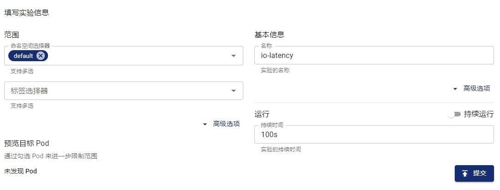

## IOChaos简介
IOChaos能够帮助你模拟文件系统故障。目前支持以下类型的故障：

1. latency：为文件系统调用加入延迟
2. fault：使文件系统调用返回错误
3. attrOverride：修改文件属性
4. mistake：使文件读到或写入错误的值

详细的功能介绍参见“使用yaml文件创建实验”。

## 注意事项
1. 请确保目标Pod上没有运行 Chaos Mesh 的 Control Manager。
2. IOChaos可能会损坏你的数据。

## 使用 dashboard 方式创建实验
1. 单击实验页面中的“新的实验”按钮进行创建实验。

   

2. 在“选择目标”处选择“文件系统注入”，并选择具体行为，如“LATENCY”

   

3. 填写实验信息，指定实验范围以及实验计划运行时间。

   

   

4. 提交实验。

   

## 使用 yaml 方式创建实验
### latency 配置文件示例

```yaml
apiVersion: chaos-mesh.org/v1alpha1
kind: IOChaos
metadata:
  name: io-latency-example
  namespace: chaos-testing
spec:
  action: latency
  mode: one
  selector:
    labelSelectors:
      app: etcd
  volumePath: /var/run/etcd
  path: '/var/run/etcd/**/*'
  delay: '100ms'
  percent: 50
  duration: '400s'
```

### fault 配置文件示例

```yaml
apiVersion: chaos-mesh.org/v1alpha1
kind: IOChaos
metadata:
  name: io-fault-example
  namespace: chaos-testing
spec:
  action: fault
  mode: one
  selector:
    labelSelectors:
      app: etcd
  volumePath: /var/run/etcd
  path: /var/run/etcd/**/*
  errno: 5
  percent: 50
  duration: "400s"
```

### attrOverride 配置文件示例

```yaml
apiVersion: chaos-mesh.org/v1alpha1
kind: IOChaos
metadata:
  name: io-attr-example
  namespace: chaos-testing
spec:
  action: attrOverride
  mode: one
  selector:
    labelSelectors:
      app: etcd
  volumePath: /var/run/etcd
  path: /var/run/etcd/**/*
  attr:
    perm: 72
  percent: 10
  duration: "400s"
```

### mistake 配置文件示例
```yaml
apiVersion: chaos-mesh.org/v1alpha1
kind: IOChaos
metadata:
  name: io-mistake-example
  namespace: chaos-testing
spec:
  action: mistake
  mode: one
  selector:
    labelSelectors:
      app: etcd
  volumePath: /var/run/etcd
  path: /var/run/etcd/**/*
  mistake:
    filling: zero
    maxOccurrences: 1
    maxLength: 10
  methods:
    - READ
    - WRITE
  percent: 10
  duration: "400s"
```

### 字段说明
#### 通用字段
|参数|类型|说明|默认值|是否必填|示例|
|---|---|---|---|---|---|
|action|string|表示具体的故障类型，仅支持latency、fault、attrOverride、mistake||是|latency|
|mode|string|表示运行实验时候的运行方式，支持one、all、fixed、fixed-percent、random-random-max-percent||是|one|
|value|string|取决与mode的取值，为mode提供参数||否|2|
|volumePath|string|volume在目标容器内的挂载点，必须为挂载的根目录||是|/var/run/etcd|
|path|string|注入错误的生效范围，可以是通配符，也可以是单个文件|默认对所有文件生效|否|/var/run/etcd/**/*|
|methods|string[]|需要注入故障的文件系统调用类型，具体支持的类型见附录A|所有类型|否|READ|
|percent|int|每次操作发生故障的概率，单位为%|100|否|100|
|containerName|string|指定注入的容器名||否||
|duration|string|指定具体实验的持续时间||是|30s|

#### 与 action 相关的字段
这些字段仅在action为对应值时才有意义

- latency

  |参数|类型|说明|默认值|是否必填|示例|
  |---|---|---|---|---|---|
  |delay|string|具体的延迟时长||是|100ms|

- fault
  |参数|类型|说明|默认值|是否必填|示例|
  |---|---|---|---|---|---|
  |errno|int|返回的错误号||是|22|

  常见的错误号参见附录B

- attrOverride
  |参数|类型|说明|默认值|是否必填|示例|
  |---|---|---|---|---|---|
  |attr|AttrOverrideSpec|具体的属性覆写规则||是|见下|

  AttrOverrideSpec定义如下
  |参数|类型|说明|默认值|是否必填|示例|
  |---|---|---|---|---|---|
  |ino|int|inode号||否||
  |size|int|文件大小||否||
  |blocks|int|文件占用块数||否||
  |atime|TimeSpec|最后访问时间||否||
  |mtime|TimeSpec|最后修改时间||否||
  |ctime|TimeSpec|最后状态变更时间||否||
  |kind|string|文件类型，详见 [fuser::FileType](https://docs.rs/fuser/0.7.0/fuser/enum.FileType.html)||否||
  |perm|int|文件权限的10进制表示||否|72（8进制下为110）|
  |nlink|int|硬链接数量||否||
  |uid|int|所有者的用户ID||否||
  |gid|int|所有者的组ID||否||
  |rdev|int|设备ID||否||

  TimeSpec定义如下
  |参数|类型|说明|默认值|是否必填|示例|
  |---|---|---|---|---|---|
  |sec|int|以秒为单位的时间戳||否||
  |nsec|int|以纳秒为单位的时间戳||否||

  关于参数的具体含义，你可以参考 [man stat](https://man7.org/linux/man-pages/man2/lstat.2.html) 。

- mistake
  |参数|类型|说明|默认值|是否必填|示例|
  |---|---|---|---|---|---|
  |mistake|MistakeSpec|具体错误规则||是||

  MistakeSpec定义如下
  |参数|类型|说明|默认值|是否必填|示例|
  |---|---|---|---|---|---|
  |filling|string|错误数据的填充内容，只能为zero（填充0）和random（填充随机字节）||是||
  |maxOccurrences|int|错误在每一次操作中最多出现次数||是|1|
  |maxLength|int|每次错误的最大长度（单位为字节）||是|1|

  我们不推荐在除了 READ 和 WRITE 之外的文件系统调用上使用 mistake 。这可能会导致预期之外的结果，包括但不限于文件系统损坏，程序崩溃等。


## 本地调试
如果你不确定某个chaos的效果，也可以使用 [toda](https://github.com/chaos-mesh/toda) 在本地测试相应功能。chaos mesh 同样使用 toda 实现 IOChaos。

## 附录A：methods 类型
- lookup
- forget
- getattr
- setattr
- readlink
- mknod
- mkdir
- unlink
- rmdir
- symlink
- rename
- link
- open
- read
- write
- flush
- release
- fsync
- opendir
- readdir
- releasedir
- fsyncdir
- statfs
- setxattr
- getxattr
- listxattr
- removexattr
- access
- create
- getlk
- setlk
- bmap

详见 [fuser::Filesystem](https://docs.rs/fuser/0.7.0/fuser/trait.Filesystem.html)

## 附录B：常见错误号
- 1: Operation not permitted
- 2: No such file or directory
- 5: I/O error
- 6: No such device or address
- 12: Out of memory
- 16: Device or resource busy
- 17: File exists
- 20: Not a directory
- 22: Invalid argument
- 24: Too many open files
- 28: No space left on device

详见 [linux源码](https://raw.githubusercontent.com/torvalds/linux/master/include/uapi/asm-generic/errno-base.h)
